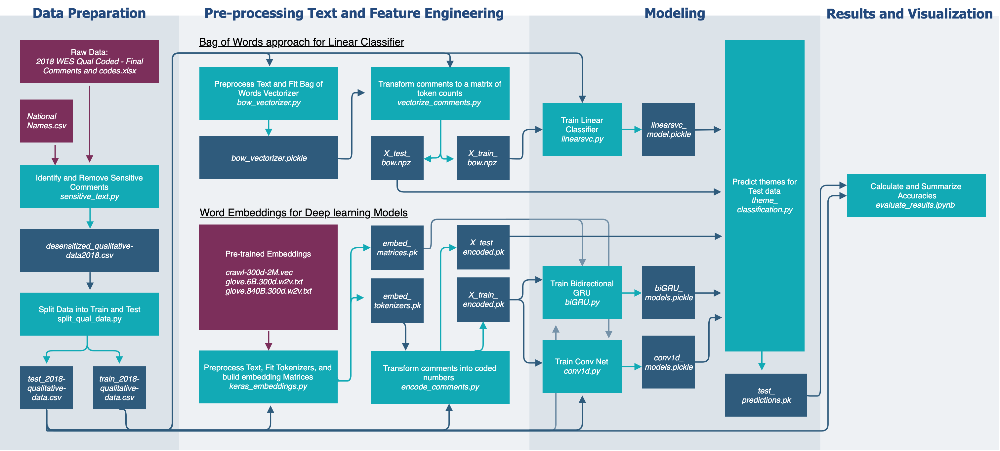
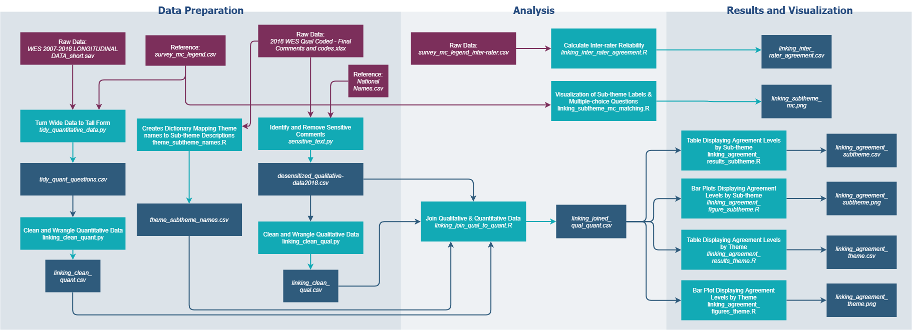

<p align="center">
  <a href="" rel="noopener">
 </a>
</p>

<h3 align="center">BC Stats Capstone | Quantifying the Responses to Open-Ended Survey Questions</h3>

---

<p align="center"> As part of the Masters of Data Science Program at UBC, we have partnered with BCStats to analyze their 2018 Work Environment Survey (WES) and to apply natural language processing on the open ended survey responses.
    <br>
</p>

## Table of Contents
- [About](#about)
- [Getting Started](#getting_started)
- [Usage - Text Classification](#usage1)
- [Usage - Linking Quantitative and Qualitative](#usage2)
- [Dependencies](#dependencies)
- [Navigating the Repository](#repo)
- [Results](#results)
- [Authors](#authors)
- [References](#references)
- [Acknowledgments](#acknowledgement)

## About <a name = "about"></a>
The BC Stats organization conducts a [Work Environment Survey](https://www2.gov.bc.ca/gov/content/data/statistics/government/employee-research/wes) gathering information from government employees across the BC Public Service. The goal of this survey is to identify areas for improvement and to understand employee engagement. Currently the survey contains ~80 multiple choice questions and one open ended written response. The written response asks the employees "What one thing would you like your organization to focus on to improve your work environment?". The responses are manually classified into 12 broad themes and 68 sub-themes and the aggregated results are reported.


The focus of this project can be split into two components.
1. Automate the text classification of the written responses using natural language processing.

2. Utilize data science tools to better understand the comments and investigate how they relate to the survey's multiple choice questions.

## Getting Started <a name = "getting_started"></a>
The first step to reproduce the multi-label theme classification and qualitative to quantitative linking, is to fork the repository. However due to sensitive information and file size limitations you will have to undergo additional steps to make sure you have the required files. The following requirements are needed to reproduce the analysis. However to solely make theme classifications on new comments you do not need the Data and Pre-trained embedding prerequisites.

### Prerequisites

To use the example_predict.py script with the pre-trained models the version of keras on your local machine must be 2.2.4.

#### Software and packages
```
python
- argparse
- gensim
- keras (Version 2.2.4)
- matplotlib
- networkx
- nltk
- numpy
- pandas
- pickle
- random
- re
- sklearn
- skmultilearn
- spacy
- scipy
- sys
- wordcloud

R
- foreign
- testthat
- tidyverse
- zoo
```

#### Data  
To fully reproduce the analysis you need the following data files stored on your local computer. These contain sensitive information and require authorization from BC Stats. Please reach out to one of the authors of this repository for more information.
```
- data/raw/2018 WES Qual Coded - Final Comments and Codes.xlsx
- data/raw/WES 2007-2018 LONGITUDINAL DATA.sav
```

To illustrate the project workflow we have provided sanitized sample files in the `data/raw/` directory.

#### Pre-trained embeddings
The text classification model makes use of three pre-trained word embeddings. The required file paths and links to download are provided below. Ensure to unzip the compressed files and have the formats exactly as below before running the keras_embeddings.py or text_summarization.py script, as this script can take over an hour to run and requires all the embeddings below.

FastText [1] | Common Craw [[Link](https://fasttext.cc/docs/en/english-vectors.html)]
```
- references/pretrained_embeddings.nosync/fasttext/crawl-300d-2M.vec
```

GloVe [2] | Wikipedia | Common Crawl [[Link](https://nlp.stanford.edu/projects/glove/)]
```
- references/pretrained_embeddings.nosync/glove/glove.6B.300d.w2v.txt
- references/pretrained_embeddings.nosync/glove/glove.840B.300d.w2v.txt
```

In order to use the GloVe embeddings they first need to be converted to w2v format. After downloading them from the link above you need to run the following script at the command line from the project root.
```
python -m gensim.scripts.glove2word2vec -i references/pretrained_embeddings.nosync/glove/glove.6B.300d.txt -o references/pretrained_embeddings.nosync/glove/glove.6B.300d.w2v.txt

python -m gensim.scripts.glove2word2vec -i references/pretrained_embeddings.nosync/glove/glove.840B.300d.txt -o references/pretrained_embeddings.nosync/glove/glove.840B.300d.w2v.txt
```

## Usage - Text Classification<a name="usage1"></a>
#### Run Classifier

You can quickly make text classifications by running the `run_classifier.py` script. This script makes theme classifications by utilizing the `conv1d_models.h5`, `biGRU_glove_wiki.h5`, `biGRU_glove_crawl.h5`, and `biGRU_fasttext_crawl.h5` models located in the models folder. To make predictions simply run the below script at the command line. For recommendations on how to best use the model, see the Data Product and Results section of the Final Report.
```
python src/models/run_classifier.py \
--input_csv FILEPATH_IN \
--output_csv FILEPATH_OUT
```
The `input_csv` and `output_csv` file path should be specified to be in the predict folder. Additionaly, the `input_csv` needs to be formatted according to the table below:

|user_id|comment|
|---|---|
|Example ID 1| Example Comment 1|
|Example ID 2| Example Comment 2|
|...| ...|

#### Run Example Prediction
For demo purposes you can test the prediction by running the command below in the project root. This will prompt you for a comment that it will predict on.
```
python src/models/example_predict.py
```

#### Reproduce Analysis
To rerun the analysis in full and re-train the models for prediction use the following command at the project root directory:
```
make all -f MakefileModel
```

To remove all files associated with this section:
```
make clean -f MakefileModel
```

## Usage - Linking Qualitative to Quantitative<a name="usage2"></a>
The Linking analysis prepares figures and tables which are further discussed in the reports. To reproduce the analysis in full run the following command at the project root directory:
```
make all -f MakefileLinking
```

To remove all files associated with this section:
```
make clean -f MakefileLinking
```

## Dependencies <a name="dependencies"></a>
**Text Classification**    


**Linking Qualitative to Quantitative**   


## Navigating the Repository <a name="repo"></a>
The correct folder structure is detailed below with all the directories for this project. By cloning the repository to your local computer you will have the same folder structure.

```
.
├── data
│   ├── interim
│   ├── output
│   ├── processed
|   └── raw
├── models
├── notebooks
├── predict
|   ├── predict_input
|   └── predict_output
├── references
|   ├── BC-stats_survey_documents
│   ├── data-dictionaries
│   ├── meeting_minutes
│   └── pretrained_embeddings.nosync
│       ├── fasttext
│       └── glove
├── reports
│   ├── figures
└── src
    ├── analysis
    ├── data
    ├── features  
    ├── models
    └── visualization
```

The folder structure and project organization has been adapted from [Cookiecutter Data Science](https://drivendata.github.io/cookiecutter-data-science/)

## Results <a name="results"></a>

|Report|Description|
|---|---|
|[Final Report](https://github.com/aaronquinton/mds-capstone-bcstats/blob/master/reports/BCStats_Final_Report.pdf)| Final BC Stats Capstone Report |
|[Linking Methodology](https://github.com/aaronquinton/mds-capstone-bcstats/blob/master/reports/linking_methodology.md)| Detailed Methodology for Linking Quantitative and Qualitative Data |
|[Test Results](https://github.com/aaronquinton/mds-capstone-bcstats/blob/master/notebooks/evaluate_results.ipynb)| Theme classification results notebook on test data |


## Authors <a name = "authors"></a>
Fan Nie | [@Jamienie](https://github.com/Jamienie)  
Ayla Pearson | [@aylapear](https://github.com/aylapear)  
Aaron Quinton | [@aaronquinton](https://github.com/aaronquinton)

## References <a name = "references"></a>

>[1] T. Mikolov, E. Grave, P. Bojanowski, C. Puhrsch, A. Joulin. [Advances in Pre-Training Distributed Word Representations](https://arxiv.org/abs/1712.09405)  
>  
> [2] Jeffrey Pennington, Richard Socher, and Christopher D. Manning. 2014. [GloVe: Global Vectors for Word Representation](https://nlp.stanford.edu/pubs/glove.pdf)


## Acknowledgements <a name = "acknowledgement"></a>
We would like to acknowledge the excellent support provided by Martin Monkman and Nasim Taba at BC Stats who provided us with the data and engaged with our analysis throughout the project. We would also like to thank Varada Kolhatkar, our UBC instructor and mentor, for her wisdom and guidance.
