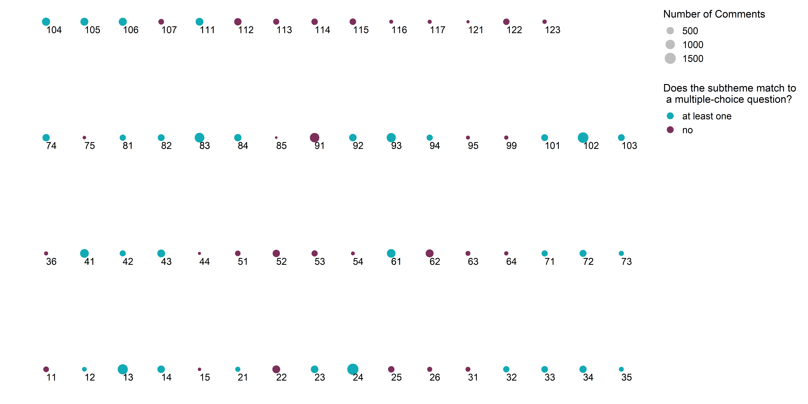

# Usage

This report gives more detail to the methodology for linking the qualitative to quantitative data sets due to the length restriction of the final report. This document also serves as a single output of the MakefileLinking.


# Introduction

Quantitative studies generate data in numerical form that can be analyzed and expressed by statistics while qualitative studies often generate non-numerical data that is more descriptive. Generally, these forms of data are analyzed separately due to their different forms. We plan to use mixed method research which finds value in integrating qualitative and quantitative data sets to help identify specific areas in the qualitative data set that are not as well represented in the quantitative data set.

# Method

### Creating link between sub-theme labels 

The first task was to create a link between the sub-theme labels used to code the comments and the multiple-choice questions. To do this each team member independently and separately matched the 80 multiple-choice questions to the sub-theme labels. For each potential match it was allowed to have no match, single match or multiple matches. The team members did not agree in every scenario so to determine the correct matching it was chosen that the majority would rule, so if two raters had the same match it would be chosen. For matches that all three team members disagreed upon they were discussed as a group and all team members had to agree on the match before moving forward. It was chosen that any matches that were hard to agree upon they would be left blank because this meant the relationship between the multiple-choice questions and sub-theme label was not as clear. 


### Cleaning and Wrangling the Data

For the qualitative data the comments relating to positive comments were removed because they do not correspond to a specific topic but are generally positive. This means it was not possible to match the comments with positive sub-theme labels to specific multiple-choice questions. Once all positive comments were removed it was assumed that all remaining comments had a negative sentiment. 

The quantitative data had to be binned into positive, neutral and negative sentiment. 


### Determining the Agreement Level Linking

Once both data set were cleaned and in a similar format they were joined and the level of agreement between the qualitative and quantitative sentiment was calculated. 

| Qualitative Sentiment | Quantitative Sentiment | Level of Agreement | 
| --------------------- | ---------------------- | ------------------ |
| Negative              | Negative               | Strong             |
| Negative              | Neutral                | Weak             |
| Negative              | Positive               | None             |


To obtain the counts for the level of agreement for each sub-theme the scoring function was chosen to be more liberal by only counting the highest agreement level for the sub-theme per person. This was done because sub-theme label and multiple-choice questions could have multiple matches. To find the agreement levels for the theme, the sub-theme agreement levels were generalized to the theme level. 


# Results

```{r, echo=FALSE, include=FALSE, message=FALSE}

library(tidyverse)
library(kableExtra)

knitr::opts_chunk$set(warning = FALSE, message = FALSE, echo=FALSE)

```


The key findings are discussed in the final report. 



<br>

```{r}
read_csv("../data/processed/linking_inter_rater_agreement.csv") %>% 
  kable()
```

<br><br><br>

#### Sub-theme Results


<br>

```{r}
read_csv("../data/processed/linking_agreement_subtheme.csv") %>% 
  arrange(desc(`Strong Agreement (%)`)) %>%
  kable()
```

<br><br><br>

#### Theme Results


<br>

```{r}
read_csv("../data/processed/linking_agreement_subtheme.csv") %>% 
  arrange(desc(`Strong Agreement (%)`)) %>% 
  kable()
```


