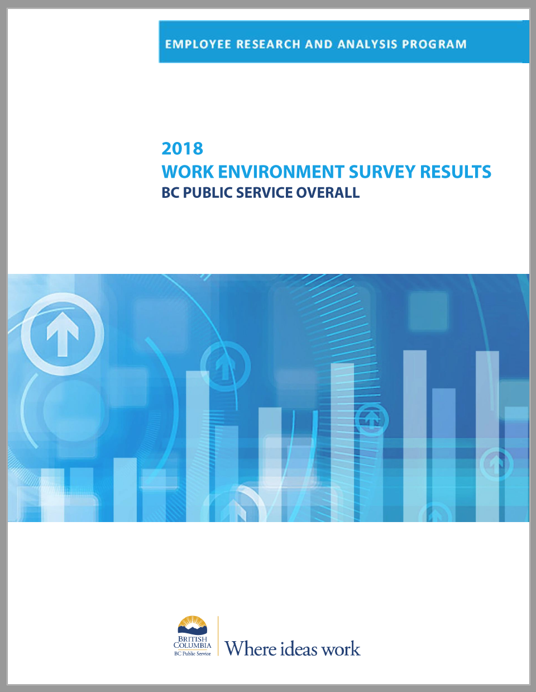
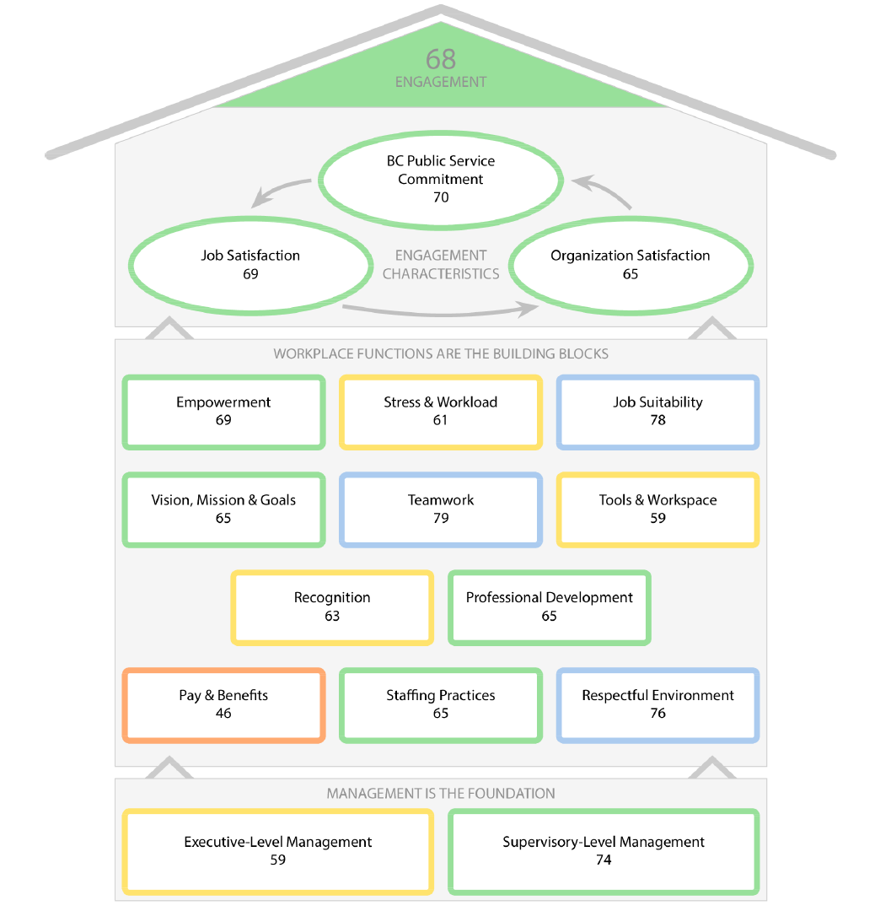
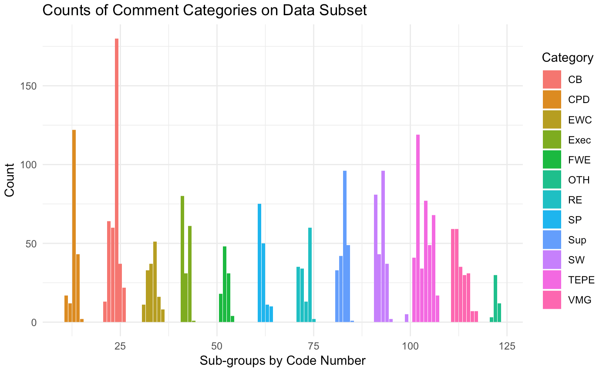
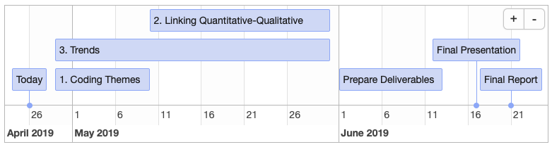

```{r setup, include=FALSE}
knitr::opts_chunk$set(echo = FALSE)
```


## Introduction | Background

<div class="columns-2">
  - Work Environment Survey (WES)  

**Primary goals:**  
 
  - Understand employee experiences 
  - Celebrate successes
  - Identify improvements   

<br>  
<br>  
  
  
</div>


## Introduction | Data

There are over 15,000 respondants across 26 ministries and over 8 survey cycles starting in 2007. All of the Survey data can be categorized in two:  
<br>
<span style="color:Darkblue">Quantitative data (Likert Scale questions)</span>     

<span style="color:Darkblue">Qualitative data (comments/open ended responses)</span>    


## Introduction | <span style="color:Darkblue">Quantitative Data</span>    

Approximatley 80 quantitative questions all related to <span style="color:Darkblue">**day-to-day work, management, performance, pay & benefits, etc.**</span>  

Examples:  

- <span style="color:Darkblue">A healthy atmosphere exists in my work unit: [1-5]</span>  
- <span style="color:Darkblue">The quality of training and development I have received is satisfactory: [1-5]</span>


## Introduction | <span style="color:Darkblue">Quantitative Data</span>  

<div class="columns-2">
  
  
  The current quantitative analysis report includes: 
  
  - aggregated multiple choice answers by ministry
  - aggregated multiple choice answers overall
  - engagement model highlighting key drivers
</div>

## Introduction | <span style="color:Darkblue">Qualitative Data</span>    

<span style="color:Darkblue">**What one thing would you like your organization to focus on to improve your work environment?**</span>

Example Themes:

- Compensation and Benefits
- Stress and Workload
- Supervisors
- etc.

## Introduction | <span style="color:Darkblue">Qualitative Data</span>  

**Example Comment**:  
<span style="color:Darkblue">*“Some work units have the latest laptop/tablets/ while others are still using old/outdated technology. Please provide fair and equal access to tools. If one unit gets an upgrade, please provide to all units.”*</span>  
<br>
**Theme**: Tools, Equipment & Physical Environment  
**Sub-theme**: Provide better computer-based hardware  

## Introduction | <span style="color:Darkblue">Qualitative Data</span>  

The current qualitative analysis report includes:
  
- manual coding of comments into 12 themes and ~60 sub-themes  
- ranking areas of improvement overall and by ministry  

## Introduction | <span style="color:Darkblue">Qualitative Data</span>   
<div class="centered">
  
</div>


## Research Question

<span style="color:Darkblue">**1. Coding Themes** - What is the best method to code the themes and sub-themes to the qualitative responses?</span>  

<span style="color:Darkblue">**2. Linking Quantitative to Qualtitative** - How well does the sentiment of the qualitative responses agree with the quantitative responses?</span>  

<span style="color:Darkblue">**3. Trends** - What trends in key engagement drivers and multiple choice questions exist over time and across departments from the 2008 to 2018 quantitative survey data?</span> 

## Data Science Techniques | <span style="color:Darkblue">**1. Coding Themes**</span>

<div class="columns-2">
**Approach:**

- Themes are previously specified and labeled (Supervised Learning) 
- Base Model: Bag of words and SVM Classification  
- Complex Model: Multiclass and Multilabel ensemble classification models 

**Challenges:**

- 60+ levels in Classification
- Multiple levels can apply to one comment

**Deliverables:**

- Trained Model for future labelling

</div>


## Data Science Techniques | <span style="color:Darkblue">**2. Linking Quantitative to Qualtitative**</span>

<div class="columns-2">
**Approach:**

- Sentiment Analysis and Emotion Recognition [Ref.](https://en.wikipedia.org/wiki/Emotion_recognition)   

Inter-rater reliability Metrics: 

- Percent agreement calculation
- Cohen's kappa
- Krippendorff's alpha  

**Challenges:**

- Comments may lack sentiment
- Or are primarily negative

**Deliverables:**

- Report
- Dashboard

</div>


## Data Science Techniques | <span style="color:Darkblue">**3. Trends Across Ministries and Overtime**</span>

<div class="columns-2">
**Approach:**

- Descriptive statistics and visualization 
- Base Model: Moving Average 
- Complex Model: Regression analysis  

**Challenges:**

- Messy data and inconsistent survey questions over time

**Deliverables:**

- Dashboard

</div>

## Timeline  



```{r timeline, include=FALSE}
library(timevis)

data <- data.frame(
  id      = 1:7,
  content = c("Today"  , "1. Coding Themes"  ,"2. Linking Quantitative-Qualitative", "3. Trends", 
              "Prepare Deliverables", "Final Presentation", "Final Report"),
  start   = c("2019-04-26", "2019-04-29", "2019-05-10", "2019-04-29", "2019-06-01", "2019-06-17", "2019-06-21"),
  end     = c(NA          , "2019-05-10", "2019-05-31", "2019-05-31", "2019-06-13", NA, NA),
  editable = TRUE
)

timevis(data, options = list( showCurrentTime = FALSE))

```


